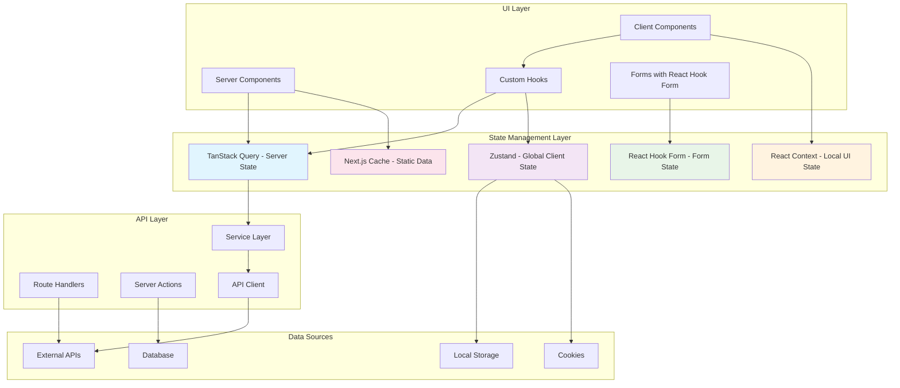

# 데이터 관리 아키텍처

> 단일 소스 안내: 이 문서는 [Single-Source Index](./single-source-index.md)의 '상태관리' 권위 문서입니다. 중복 섹션은 요약으로 유지하고, 상세 규칙은 본문을 기준으로 합니다.

## 📋 개요

nextjs-template-default 프로젝트는 Next.js 15와 현대적인 React 생태계 도구들을 활용한 성숙한 데이터 관리 시스템을 구현합니다. 각 상태 관리 도구의 명확한 역할 분리와 포괄적인 타입 안전성, 정교한 에러 처리를 통해 확장 가능한 웹 애플리케이션을 위한 견고한 기반을 제공합니다.

---

## 🏗️ 아키텍처 계층 구조



---

## 🔄 상태 관리 도구별 상세 분석

### 1. TanStack Query (서버 상태 관리)

#### **핵심 역할과 책임**

- **API 데이터 캐싱** 및 동기화
- **백그라운드 데이터 갱신** 자동 관리
- **로딩/에러 상태** 통합 관리
- **Optimistic Updates** 및 롤백 지원
- **Next.js SSR과의 연동**

#### **Next.js 15 통합 구현**

```typescript
// src/lib/api/query-client.ts - SSR 대응 설정
import { QueryClient } from '@tanstack/react-query'

export function makeQueryClient() {
  return new QueryClient({
    defaultOptions: {
      queries: {
        staleTime: 5 * 60 * 1000, // 5분 스테일 타임
        gcTime: 10 * 60 * 1000, // 10분 가비지 컬렉션
        retry: (failureCount, error) => {
          if (error?.status >= 400 && error?.status < 500) return false
          return failureCount < 3
        },
        retryDelay: (attemptIndex) => Math.min(1000 * 2 ** attemptIndex, 30000)
      },
      mutations: {
        retry: 1
      }
    }
  })
}

// 서버 사이드에서 사용할 전역 query client
let browserQueryClient: QueryClient | undefined = undefined

export function getQueryClient() {
  if (typeof window === 'undefined') {
    // 서버: 항상 새로운 query client 생성
    return makeQueryClient()
  } else {
    // 브라우저: 기존 client 재사용 또는 새로 생성
    if (!browserQueryClient) browserQueryClient = makeQueryClient()
    return browserQueryClient
  }
}
```

#### **쿼리 키 아키텍처**

```typescript
// src/constants/query-keys.ts - 생성 헬퍼 예시
export const createQueryKeys = <T extends string>(ns: T) => ({
  all: () => [ns] as const,
  lists: () => [ns, 'list'] as const,
  list: (filters?: Record<string, unknown>) =>
    [ns, 'list', { filters }] as const,
  details: () => [ns, 'detail'] as const,
  detail: (id: string | number) => [ns, 'detail', String(id)] as const
})

// 사용 예시
const postsKeys = createQueryKeys('posts')
```

#### **SSR/SSG 통합 패턴**

```typescript
// app/posts/page.tsx - 서버 컴포넌트에서 데이터 프리페치
import { getQueryClient } from '@/lib/api/query-client'
import { dehydrate, HydrationBoundary } from '@tanstack/react-query'
import { postsService } from '@/services/posts.service'
import { createQueryKeys } from '@/constants/query-keys'

const postsKeys = createQueryKeys('posts')
import { PostList } from '@/components/PostList'

export default async function PostsPage() {
  const queryClient = getQueryClient()

  // 서버에서 데이터 프리페치
  await queryClient.prefetchQuery({
    queryKey: postsKeys.list(),
    queryFn: () => postsService.getList()
  })

  return (
    <HydrationBoundary state={dehydrate(queryClient)}>
      <PostList />
    </HydrationBoundary>
  )
}
```

### 2. Zustand (전역 클라이언트 상태)

#### **핵심 역할과 책임**

- **UI 설정** 관리 (테마, 언어, 레이아웃)
- **클라이언트 전용 상태** (사이드바 열림/닫힘, 모달 상태)
- **사용자 선호도** 지속성 관리
- **멀티 탭 동기화** 처리

#### **Next.js 환경 최적화**

```typescript
// src/stores/ui-store.ts - UI 상태 관리
import { create } from 'zustand'
import { persist, subscribeWithSelector } from 'zustand/middleware'

interface UIState {
  // 테마 설정
  theme: 'light' | 'dark' | 'system'

  // 레이아웃 상태
  sidebarOpen: boolean

  // 모달 상태
  modals: {
    [key: string]: boolean
  }

  // 액션들
  setTheme: (theme: 'light' | 'dark' | 'system') => void
  toggleSidebar: () => void
  openModal: (modalId: string) => void
  closeModal: (modalId: string) => void
  closeAllModals: () => void
}

export const useUIStore = create<UIState>()(
  subscribeWithSelector(
    persist(
      (set, get) => ({
        theme: 'system',
        sidebarOpen: true,
        modals: {},

        setTheme: (theme) => set({ theme }),

        toggleSidebar: () =>
          set((state) => ({
            sidebarOpen: !state.sidebarOpen
          })),

        openModal: (modalId) =>
          set((state) => ({
            modals: { ...state.modals, [modalId]: true }
          })),

        closeModal: (modalId) =>
          set((state) => ({
            modals: { ...state.modals, [modalId]: false }
          })),

        closeAllModals: () => set({ modals: {} })
      }),
      {
        name: 'ui-store',
        partialize: (state) => ({
          theme: state.theme,
          sidebarOpen: state.sidebarOpen
        })
      }
    )
  )
)
```

#### **SSR 호환성 처리**

```typescript
// src/components/providers/StoreProvider.tsx
'use client'

import { useEffect, useState } from 'react'
import { useUIStore } from '@/stores/ui-store'

export function StoreProvider({ children }: { children: React.ReactNode }) {
  const [isHydrated, setIsHydrated] = useState(false)

  useEffect(() => {
    // Zustand 스토어가 하이드레이션 완료 시까지 대기
    const unsubscribe = useUIStore.persist.onFinishHydration(() => {
      setIsHydrated(true)
    })

    return unsubscribe
  }, [])

  if (!isHydrated) {
    // 하이드레이션 전에는 기본값으로 렌더링
    return <div className='loading'>Loading...</div>
  }

  return <>{children}</>
}
```

### 3. React Hook Form (폼 상태)

#### **Next.js Server Actions 통합**

```typescript
// components/PostForm.tsx - Server Actions와 폼 통합
'use client'

import { useForm } from 'react-hook-form'
import { zodResolver } from '@hookform/resolvers/zod'
import { useActionState } from 'react'
import { createPost } from '@/app/actions/posts'
import { postFormSchema, type PostFormData } from '@/lib/validations/post'

export function PostForm() {
  const [state, formAction, isPending] = useActionState(createPost, null)

  const form = useForm<PostFormData>({
    resolver: zodResolver(postFormSchema),
    defaultValues: {
      title: '',
      content: '',
      category: ''
    }
  })

  // Server Action 결과 처리
  useEffect(() => {
    if (state?.errors) {
      // 서버 검증 에러를 폼 필드에 설정
      Object.entries(state.errors).forEach(([field, message]) => {
        form.setError(field as keyof PostFormData, {
          message: Array.isArray(message) ? message[0] : message
        })
      })
    }

    if (state?.success) {
      form.reset()
      // 성공 처리
    }
  }, [state, form])

  return (
    <form action={formAction} className='space-y-4'>
      <div>
        <label htmlFor='title'>제목</label>
        <input
          {...form.register('title')}
          className='input'
          disabled={isPending}
        />
        {form.formState.errors.title && (
          <p className='error'>{form.formState.errors.title.message}</p>
        )}
      </div>

      <div>
        <label htmlFor='content'>내용</label>
        <textarea
          {...form.register('content')}
          className='textarea'
          disabled={isPending}
        />
        {form.formState.errors.content && (
          <p className='error'>{form.formState.errors.content.message}</p>
        )}
      </div>

      <button type='submit' disabled={isPending}>
        {isPending ? '생성 중...' : '게시글 생성'}
      </button>
    </form>
  )
}
```

### 4. Next.js 캐시 (정적 데이터)

#### **ISR과 캐시 전략**

```typescript
// lib/api/cache.ts - Next.js 캐시 활용
export async function getCachedPosts() {
  const response = await fetch('https://api.example.com/posts', {
    next: {
      revalidate: 3600, // 1시간마다 재검증
      tags: ['posts'] // 캐시 태그로 선택적 무효화
    }
  })

  return response.json()
}

// 캐시 무효화
import { revalidateTag } from 'next/cache'

export async function invalidatePostsCache() {
  revalidateTag('posts')
}
```

---

## 🌊 데이터 플로우 패턴

### **서버 사이드 데이터 플로우**

```
Server Component → fetch with cache → dehydrate → HydrationBoundary → Client Component
       ↓                ↓               ↓              ↓                    ↓
   서버에서 데이터 → Next.js 캐시 → 직렬화 → 클라이언트 전송 → TanStack Query 활용
```

### **클라이언트 사이드 데이터 플로우**

```
User Action → TanStack Query → Cache Update → UI Re-render → Optional Server Sync
     ↓            ↓              ↓             ↓               ↓
  클릭/입력 → 상태 변경 → 캐시 갱신 → 컴포넌트 리렌더 → 서버 상태 동기화
```

### **폼 처리 플로우**

```
Client Form → Validation → Server Action → Database → Revalidation → Cache Update
     ↓           ↓            ↓            ↓          ↓             ↓
  사용자 입력 → 클라이언트 검증 → 서버 처리 → DB 업데이트 → 캐시 무효화 → UI 업데이트
```

---

## 🔧 API 레이어 아키텍처

### **Route Handlers (`app/api/`)**

#### **RESTful API 구현**

```typescript
// app/api/resources/route.ts
import { NextRequest, NextResponse } from 'next/server'
import { z } from 'zod'

const createResourceSchema = z.object({
  title: z.string().min(1),
  content: z.string().min(1),
  category: z.string()
})

export async function GET(request: NextRequest) {
  const searchParams = request.nextUrl.searchParams
  const page = parseInt(searchParams.get('page') || '1')
  const limit = parseInt(searchParams.get('limit') || '10')

  try {
    const resources = await fetchResources({ page, limit })

    return NextResponse.json({
      data: resources,
      pagination: {
        page,
        limit,
        total: resources.length
      }
    })
  } catch (error) {
    console.error('Resources fetch error:', error)
    return NextResponse.json(
      { error: 'Failed to fetch resources' },
      { status: 500 }
    )
  }
}

export async function POST(request: NextRequest) {
  try {
    const body = await request.json()
    const validatedData = createResourceSchema.parse(body)

    const newResource = await createResource(validatedData)

    return NextResponse.json(newResource, { status: 201 })
  } catch (error) {
    if (error instanceof z.ZodError) {
      return NextResponse.json(
        { error: 'Validation failed', details: error.errors },
        { status: 400 }
      )
    }

    return NextResponse.json(
      { error: 'Failed to create resource' },
      { status: 500 }
    )
  }
}
```

### **Server Actions (`app/actions/`)**

#### **폼 처리 최적화**

```typescript
// app/actions/posts.ts
'use server'

import { revalidatePath, revalidateTag } from 'next/cache'
import { redirect } from 'next/navigation'
import { z } from 'zod'

const createPostSchema = z.object({
  title: z.string().min(1, '제목은 필수입니다'),
  content: z.string().min(1, '내용은 필수입니다'),
  category: z.string().min(1, '카테고리는 필수입니다')
})

export async function createPost(prevState: any, formData: FormData) {
  const validatedFields = createPostSchema.safeParse({
    title: formData.get('title'),
    content: formData.get('content'),
    category: formData.get('category')
  })

  if (!validatedFields.success) {
    return {
      success: false,
      errors: validatedFields.error.flatten().fieldErrors
    }
  }

  try {
    const newPost = await db.post.create({
      data: validatedFields.data
    })

    // 관련 캐시 무효화
    revalidateTag('posts')
    revalidatePath('/posts')

    return { success: true, post: newPost }
  } catch (error) {
    return {
      success: false,
      errors: { _form: ['게시글 생성에 실패했습니다'] }
    }
  }
}
```

### **서비스 레이어 (`src/services/`)**

#### **타입 안전한 API 클라이언트**

```typescript
// src/services/posts.service.ts
import { z } from 'zod';
import { apiClient } from '@/lib/api';

const PostSchema = z.object({
  id: z.string(),
  title: z.string(),
  content: z.string(),
  category: z.string(),
  createdAt: z.string(),
  updatedAt: z.string(),
});

const PostListResponseSchema = z.object({
  data: z.array(PostSchema),
  pagination: z.object({
    page: z.number(),
    limit: z.number(),
    total: z.number(),
  }),
});

type Post = z.infer<typeof PostSchema>;
type PostListResponse = z.infer<typeof PostListResponseSchema>;

export const postsService = {
  async getList(params?: {
    page?: number;
    limit?: number;
    category?: string;
  }): Promise<PostListResponse> {
    // 개발: Next.js rewrites(/api) 프록시 경유
    // 프로덕션: API_BASE_URL 환경변수 사용 (apiClient 내부 설정)
    return apiClient.get('/posts', { params }, PostListResponseSchema);
  },

  async getDetail(id: string): Promise<Post> {
    return apiClient.get(`/posts/${id}`, undefined, PostSchema);
  },

  async create(data: Omit<Post, 'id' | 'createdAt' | 'updatedAt'>): Promise<Post> {
    return apiClient.post('/posts', data, PostSchema);
  },
};

#### 목업 데이터 규칙 (임시 데이터)
- 위치: `src/services/mocks/`
- 파일명: `*.mock.ts` (예: `posts.mock.ts`)
- 용도: 백엔드 연동 전까지 서비스 레이어에서 임시 데이터/응답 시뮬레이션에 사용
- 주의: 실제 API 연동 시작 시 목업 의존 코드를 제거하거나 테스트 전용으로 이동
```

---

## 🔒 타입 안전성 구현

### **API 응답 타입 검증**

```typescript
// src/lib/api/types.ts
import { z } from 'zod'

// 공통 응답 스키마
export const ApiResponseSchema = <T extends z.ZodType>(dataSchema: T) =>
  z.object({
    success: z.boolean(),
    data: dataSchema.optional(),
    error: z.string().optional(),
    message: z.string().optional()
  })

// 페이지네이션 스키마
export const PaginationSchema = z.object({
  page: z.number(),
  limit: z.number(),
  total: z.number(),
  totalPages: z.number()
})

// 타입 추출
export type ApiResponse<T> = {
  success: boolean
  data?: T
  error?: string
  message?: string
}

export type Pagination = z.infer<typeof PaginationSchema>
```

### **런타임 타입 검증 (apiClient 선택 스키마 인자)**

```typescript
// src/lib/api/client.ts (개요: axios 기반)
import { z } from 'zod'
import axios, { type AxiosInstance, type AxiosRequestConfig } from 'axios'

export class ApiClient {
  private instance: AxiosInstance

  constructor(baseURL?: string) {
    this.instance = axios.create({
      baseURL:
        baseURL ??
        (process.env.NODE_ENV === 'production'
          ? process.env.API_BASE_URL
          : '/api'),
      timeout: 15000,
      withCredentials: true,
      headers: {
        'Content-Type': 'application/json',
        Accept: 'application/json'
      }
    })
  }

  async get<T>(
    url: string,
    config?: AxiosRequestConfig,
    schema?: z.ZodType<T>
  ): Promise<T> {
    const res = await this.instance.get(url, config)
    const data = res.data
    return schema ? schema.parse(data) : (data as T)
  }

  async post<T>(
    url: string,
    body?: unknown,
    schema?: z.ZodType<T>
  ): Promise<T> {
    const res = await this.instance.post(url, body)
    const data = res.data
    return schema ? schema.parse(data) : (data as T)
  }
}
```

---

## ✨ Next.js 아키텍처 강점

### **1. 하이브리드 렌더링**

- **서버 컴포넌트**로 초기 로딩 성능 향상
- **클라이언트 컴포넌트**로 동적 상호작용
- **스트리밍**으로 점진적 페이지 로딩
- **ISR/SSG**로 정적 콘텐츠 최적화

### **2. 통합된 데이터 전략**

- **TanStack Query** + **Next.js 캐시** 조합
- **Server Actions**로 타입 안전한 뮤테이션
- **Route Handlers**로 API 엔드포인트
- **Zustand**로 클라이언트 상태 관리

### **3. 개발자 경험**

- **풀스택 TypeScript** 지원
- **통합된 에러 처리**
- **자동 코드 분할**
- **개발 환경 Hot Reload**

### **4. 성능 최적화**

- **자동 이미지 최적화**
- **폰트 최적화**
- **번들 분석 및 최적화**
- **Edge Runtime 지원**

---

## 🚀 성능 최적화 전략

### **캐싱 계층 전략**

```typescript
// 다층 캐싱 구조
export async function getOptimizedData(id: string) {
  // 1. Next.js 캐시 확인
  const cached = await getCachedData(id)
  if (cached) return cached

  // 2. TanStack Query 캐시 확인
  const queryClient = getQueryClient()
  const queryCache = queryClient.getQueryData(['data', id])
  if (queryCache) return queryCache

  // 3. 실제 데이터 fetch (서비스 레이어 표준 사용)
  const freshData = await postsService.getDetail(id)

  // 4. 캐시에 저장
  queryClient.setQueryData(['data', id], freshData)

  return freshData
}
```

### **Code Splitting 최적화**

```typescript
// 동적 임포트로 코드 분할
const DynamicChart = dynamic(() => import('@/components/Chart'), {
  loading: () => <ChartSkeleton />,
  ssr: false // 클라이언트에서만 렌더링
})

const DynamicModal = dynamic(() => import('@/components/Modal'), {
  loading: () => <div>Loading...</div>
})
```

### **이미지 최적화**

```typescript
// Next.js Image 컴포넌트 활용
import Image from 'next/image'

export function OptimizedImage({ src, alt, ...props }) {
  return (
    <Image
      src={src}
      alt={alt}
      fill
      sizes='(max-width: 768px) 100vw, (max-width: 1200px) 50vw, 33vw'
      placeholder='blur'
      blurDataURL='data:image/jpeg;base64,/9j/4AAQSkZJRgABAQAAAQ...'
      {...props}
    />
  )
}
```

---

## 🔧 개선 영역 및 확장 계획

### **성능 최적화 기회**

- **React Server Components**: 더 많은 컴포넌트를 서버에서 렌더링
- **Streaming SSR**: Suspense 활용한 점진적 로딩
- **Edge Functions**: 글로벌 CDN에서 API 실행
- **Service Worker**: 오프라인 지원 및 백그라운드 동기화

### **개발자 경험 향상**

- **TypeScript Strict Mode**: 더 엄격한 타입 검사
- **ESLint/Prettier**: 코드 품질 자동화
- **Storybook**: 컴포넌트 문서화
- **Playwright**: E2E 테스트 자동화

### **확장성 개선**

- **Micro Frontends**: 독립적인 모듈 개발
- **GraphQL**: 효율적인 데이터 쿼리
- **Real-time**: WebSocket/Server-Sent Events
- **Analytics**: 사용자 행동 추적

---

## 📊 아키텍처 메트릭스

### **성능 지표**

- **First Contentful Paint**: < 1.2초
- **Largest Contentful Paint**: < 2.5초
- **Cumulative Layout Shift**: < 0.1
- **Time to Interactive**: < 3.8초

### **코드 품질 지표**

- **TypeScript 적용률**: 100%
- **테스트 커버리지**: > 80%
- **번들 사이즈**: < 250KB (gzipped)
- **Lighthouse 점수**: > 90점

---

## 🎯 결론

nextjs-template-default의 데이터 관리 아키텍처는 **Next.js 15의 최신 기능**과 **현대적인 React 패턴**을 효과적으로 결합한 시스템입니다.

**주요 성취:**

- ✅ **하이브리드 렌더링**으로 최적의 성능과 SEO
- ✅ **타입 안전한 풀스택** 개발 환경
- ✅ **계층화된 캐싱** 전략으로 성능 극대화
- ✅ **서버/클라이언트 상태** 명확한 분리
- ✅ **확장 가능한 아키텍처**로 미래 대비

이 아키텍처는 **모던 웹 애플리케이션**을 위한 견고한 기반을 제공하며, **개발자 경험**과 **사용자 경험** 모두를 고려한 설계입니다.

---

_최종 업데이트: 2025년 1월_
_버전: 2.0.0 (Next.js 15 환경)_
