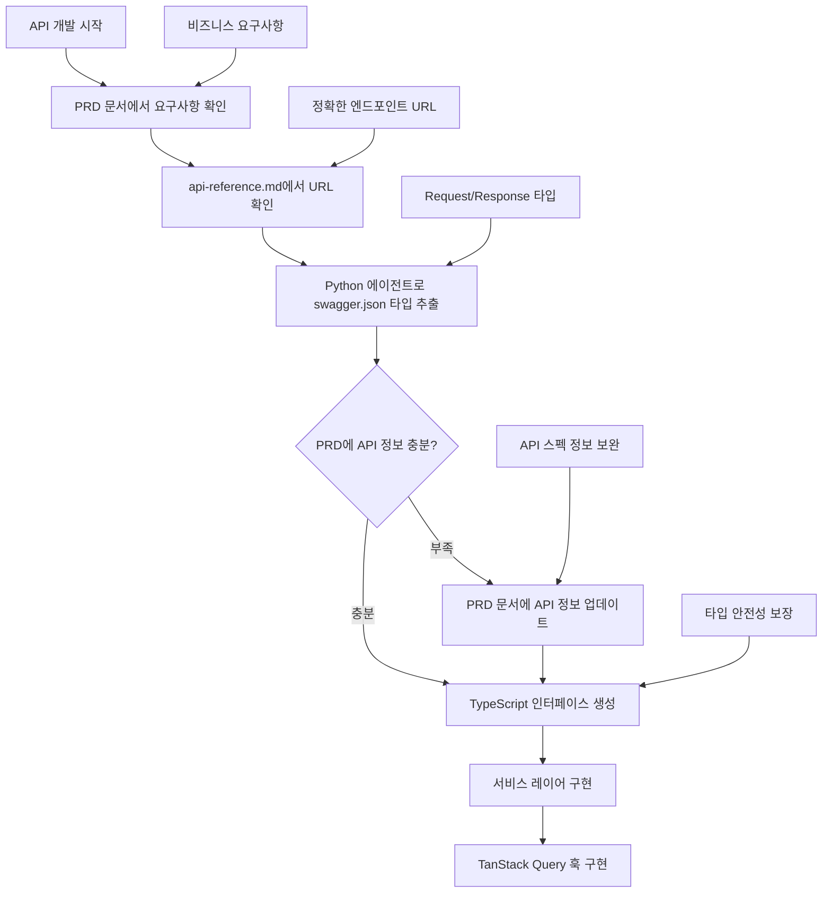

# API 연동 워크플로우 가이드

> 단일 소스 안내: 이 문서는 [Single-Source Index](./single-source-index.md)의 'API 워크플로우' 권위 문서입니다. 중복 섹션은 요약으로 유지하고, 상세 규칙은 본문을 기준으로 합니다.

## 🚨 필수 원칙

본 가이드는 실무 절차에 집중합니다. 상태 관리 도구의 역할/제약, 쿼리 키 규칙 등 설계 원칙은 단일 권위 문서인 [데이터 관리 아키텍처](./data-management-architecture.md)를 참조하세요.

---

## 📋 API 연동 체크리스트

### 1. API 개발 전 필수 확인사항

- [ ] **URL 표준화**: `docs/api-reference.md` 문서 기준 엔드포인트 URL 사용
- [ ] **요구사항(PRD) 확인**: `docs/project/` 또는 현재 작업 Plan(`docs/plans/*.md`)에서 요구사항 확인
- [ ] **타입 정보 추출**: `docs/swagger.json`에서 타입 정보 확인(필요 시 도구 활용)
- [ ] **요구사항/Plan 업데이트**: swagger.json 확인 후 정보 부족 시 Plan/프로젝트 문서에 보완
- [ ] **기본 구조 확인**: `src/lib/api/` 구조 이해
- [ ] **API 클라이언트 사용**: `apiClient` import 및 활용
- [ ] **쿼리 키 관리**: `src/constants/query-keys.ts` 상수 활용

### 2. PRD 문서 기반 API 개발 플로우

API 구현 전 PRD 문서와 swagger.json을 연계하여 완전한 정보를 확보:

#### **Step 1: 요구사항(Plan/PRD) 우선 확인**

```markdown
요구사항 확인 절차:

1. 우선 확인: docs/project/\* 내 관련 기능 문서
2. 병행 확인: 현재 작업 Plan 문서 (docs/plans/YYYY-MM-DD-<feature>.md)
3. 확인 항목:
   - 해당 API 기능의 비즈니스 요구사항
   - 사용자 시나리오 및 유스케이스
   - 기능적/비기능적 요구사항
   - 예외 처리 규칙

검색 예시:
"PRD 문서에서 '배너 관리' 또는 'banner' 관련 요구사항을 찾아서 정리해줘"
```

#### **Step 2: Python 서브 에이전트 타입 정보 추출**

```markdown
도구 활용 지침(선택):

1. 목적: swagger.json에서 특정 API 엔드포인트의 타입 정보 추출
2. 대상 파일: /docs/swagger.json
3. 추출 정보:
   - Request 스키마 (Command 객체)
   - Response 스키마 (ResponseV1<Type> + View 객체)
   - 필수 필드 (required 배열)
   - 타입 제약사항 (format, validation 규칙)

사용 예시:
"Python 서브 에이전트를 이용해 swagger.json에서 '/admin/v1/banner' POST 엔드포인트의
요청/응답 타입 정보를 추출해 TypeScript 인터페이스로 변환해줘"
```

#### **Step 3: Plan/문서 업데이트 (정보 부족 시)**

```markdown
Plan/문서 업데이트 내용:

1. 조건: 요구사항 문서나 Plan에 해당 API 정보가 부족한 경우
2. 추가할 정보:
   - API 엔드포인트 URL
   - 요청/응답 타입 정보
   - 필수/선택 필드 목록
   - 데이터 형식 및 제약사항

업데이트 예시:
"Plan/문서에 배너 관리 API 정보 추가:

- 엔드포인트: POST /admin/v1/banner
- 요청 타입: {title: string, content: string, displayOrder: number, isActive: boolean}
- 응답 타입: ResponseV1<BannerView>
- 필수 필드: title, content, displayOrder"
```

### 3. 데이터 조회 (Query)

```typescript
// ✅ 올바른 패턴
import { useApiQuery } from '@/lib/api'
import { queryKeys } from '@/constants/query-keys'

function useNoticeList(filters?: NoticeFilters) {
  return useApiQuery({
    queryKey: queryKeys.notice.list(filters),
    queryFn: () => apiClient.get<Notice[]>('/notices', { params: filters }),
    staleTime: 5 * 60 * 1000 // 5분
  })
}
```

### 4. 데이터 수정 (Mutation)

```typescript
// ✅ 올바른 패턴
import { useApiMutation } from '@/lib/api'
import { queryKeys, queryInvalidation } from '@/lib/api'

function useCreateNotice() {
  return useApiMutation({
    mutationFn: (data: CreateNoticeRequest) =>
      apiClient.post<Notice>('/notices', data),
    meta: {
      invalidates: [queryKeys.notice.list()] // 자동 무효화
    },
    onSuccess: () => {
      toast.success('공지사항이 등록되었습니다.')
    }
  })
}
```

### 5. 에러 처리

```typescript
// ✅ 자동 에러 처리 (기본값)
const { data, error, isLoading } = useApiQuery({
  queryKey: ['notices'],
  queryFn: () => apiClient.get('/notices')
  // 자동으로 toast 에러 메시지 표시
})

// ✅ 조용한 에러 처리
const query = useApiQuery({
  queryKey: ['notices'],
  queryFn: () => apiClient.get('/notices'),
  meta: { silent: true }, // 토스트 비활성화
  onError: (error) => {
    // 커스텀 에러 처리
    console.error('조용한 에러:', error)
  }
})

// ✅ 폼 에러 처리 (React Hook Form)
const mutation = useApiMutation({
  mutationFn: (data) => apiClient.post('/notices', data),
  onError: (error) => {
    ApiErrorHandler.handleFormError(error, setError)
  }
})
```

---

## 🏗️ 서비스 레이어 구조

### 표준 개발 플로우 (PRD + URL + 타입 정보 기반)



### 도메인별 API 서비스 구성

```
src/services/
├── notice.service.ts     # 공지사항 API
├── banner.service.ts     # 배너 API
├── member.service.ts     # 회원 API
├── dashboard.service.ts  # 대시보드 API
└── mocks/                # 목업 데이터 (*.mock.ts)
```

### 서비스 파일 예시 (타입 안전성 기반)

```typescript
// src/services/banner.service.ts
import { apiClient } from '@/lib/api'

// 1️⃣ Python 에이전트로 추출한 타입 정의
interface BannerCreateCommand {
  title: string
  content: string
  imageUrl?: string
  linkUrl?: string
  displayOrder: number
  isActive: boolean
  startDate: string
  endDate: string
}

interface BannerView {
  bannerNo: number
  title: string
  content: string
  imageUrl?: string
  linkUrl?: string
  displayOrder: number
  isActive: boolean
  startDate: string
  endDate: string
  createDt: string
  updateDt: string
}

interface ResponseV1BannerView {
  data: BannerView
  status: number
  code: number
  message: string
}

// 2️⃣ api-reference.md 기준 정확한 URL 사용
export const bannerService = {
  // 목록 조회: GET /admin/v1/banner
  getList: (params?: Record<string, unknown>) =>
    apiClient.get<BannerView[]>('/admin/v1/banner', { params }),

  // 상세 조회: GET /admin/v1/banner/{bannerNo}
  getDetail: (bannerNo: number) =>
    apiClient.get<ResponseV1BannerView>(`/admin/v1/banner/${bannerNo}`),

  // 생성: POST /admin/v1/banner
  create: (data: BannerCreateCommand) =>
    apiClient.post<ResponseV1BannerView>('/admin/v1/banner', data),

  // 수정: PUT /admin/v1/banner/{bannerNo}
  update: (bannerNo: number, data: BannerCreateCommand) =>
    apiClient.put<ResponseV1BannerView>(`/admin/v1/banner/${bannerNo}`, data),

  // 삭제: DELETE /admin/v1/banner
  delete: (bannerNos: number[]) =>
    apiClient.delete('/admin/v1/banner', { data: { bannerNos } })
}
```

---

## 🔄 실제 사용 패턴

### 1. 타입 안전한 목록 페이지 구현

```typescript
// components/admin/banner/BannerList.tsx
import { useApiQuery } from '@/lib/api'
import { queryKeys } from '@/constants/query-keys'
import { bannerService } from '@/services/banner.service'

// Python 에이전트로 추출한 검색 필터 타입
interface BannerSearchCommand {
  title?: string
  isActive?: boolean
  startDate?: string
  endDate?: string
  page: number
  size: number
}

export function BannerList() {
  const [filters, setFilters] = useState<BannerSearchCommand>({
    page: 0,
    size: 20
  })

  // api-reference.md 기준 정확한 엔드포인트
  const {
    data: banners,
    isLoading,
    error
  } = useApiQuery({
    queryKey: queryKeys.admin.banner.list(filters),
    queryFn: () => bannerService.getList(filters),
    staleTime: 5 * 60 * 1000 // 5분 캐시
  })

  if (isLoading) return <LoadingSkeleton />
  if (error) return <ErrorMessage /> // 자동 토스트 표시

  return <DataTable data={banners} columns={bannerColumns} />
}
```

### 2. 타입 검증 기반 생성/수정 폼

```typescript
// components/admin/banner/BannerForm.tsx
import { useForm } from 'react-hook-form'
import { zodResolver } from '@hookform/resolvers/zod'
import { z } from 'zod'
import { useApiMutation } from '@/lib/api'
import {
  bannerService,
  type BannerCreateCommand
} from '@/services/banner.service'
import { useRouter } from 'next/navigation'

// Python 에이전트로 추출한 스키마를 Zod로 변환
const bannerFormSchema = z.object({
  title: z.string().min(1, '제목은 필수입니다'),
  content: z.string().min(1, '내용은 필수입니다'),
  imageUrl: z.string().url('올바른 URL 형식이어야 합니다').optional(),
  linkUrl: z.string().url('올바른 URL 형식이어야 합니다').optional(),
  displayOrder: z.number().min(0, '표시 순서는 0 이상이어야 합니다'),
  isActive: z.boolean(),
  startDate: z.string().min(1, '시작일은 필수입니다'),
  endDate: z.string().min(1, '종료일은 필수입니다')
})

type BannerFormData = z.infer<typeof bannerFormSchema>

export function BannerForm({ bannerNo }: { bannerNo?: number }) {
  const form = useForm<BannerFormData>({
    resolver: zodResolver(bannerFormSchema),
    defaultValues: {
      displayOrder: 0,
      isActive: true
    }
  })

  const router = useRouter()

  const createMutation = useApiMutation({
    mutationFn: (data: BannerCreateCommand) => bannerService.create(data),
    meta: {
      invalidates: [queryKeys.admin.banner.list()]
    },
    onSuccess: () => {
      toast.success('배너가 등록되었습니다.')
      router.replace('/admin/banners')
    },
    onError: (error) => {
      ApiErrorHandler.handleFormError(error, form.setError)
    }
  })

  const onSubmit = (data: BannerFormData) => {
    createMutation.mutate(data)
  }

  return (
    <form onSubmit={form.handleSubmit(onSubmit)}>
      {/* React Hook Form + Zod 검증 기반 폼 컴포넌트들 */}
      <Button
        type='submit'
        loading={createMutation.isPending}
        disabled={!form.formState.isValid}
      >
        등록
      </Button>
    </form>
  )
}
```

### 3. Optimistic Update 예시

```typescript
// 즉시 UI 업데이트가 필요한 경우
const toggleMutation = useOptimisticMutation({
  queryKey: queryKeys.notice.detail(id),
  mutationFn: (data) => noticeService.update(id, data),
  optimisticUpdate: (variables, previousData) => ({
    ...previousData,
    isActive: variables.isActive
  })
})
```

---

## 🚫 안티패턴 (절대 하지 말 것)

```typescript
// ❌ api-reference.md 확인 없이 임의 URL 사용
const { data } = useQuery({
  queryKey: ['banners'],
  queryFn: () => apiClient.get('/banners') // 잘못된 URL
  // 정확한 URL: /admin/v1/banner
})

// ❌ swagger.json 확인 없이 임의 타입 사용
interface Banner {
  id: string // 실제는 bannerNo: number
  name: string // 실제는 title: string
}

// ❌ Zustand로 서버 데이터 관리
const useBannerStore = create((set) => ({
  banners: [],
  fetchBanners: async () => {
    const data = await apiClient.get('/admin/v1/banner')
    set({ banners: data })
  }
}))

// ❌ Python 서브 에이전트 활용 없이 추측으로 타입 작성
const createBanner = (data: any) => {
  // any 사용 금지
  return apiClient.post('/admin/v1/banner', data)
}

// ❌ 일관성 없는 쿼리 키
useQuery({
  queryKey: ['banner', 'list'], // 대신 queryKeys.admin.banner.list() 사용
  queryFn: () => bannerService.getList()
})
```

---

---

## 🏗️ 프록시 및 네트워크 구조

### 개발 환경 프록시 설정 (Next.js)

```typescript
// next.config.js
/** @type {import('next').NextConfig} */
const nextConfig = {
  async rewrites() {
    return [
      {
        source: '/api/:path*',
        destination: 'http://api.example.com/:path*' // API 서버로 프록시
      }
    ]
  },
  env: {
    API_BASE_URL: 'http://api.example.com'
  }
}

module.exports = nextConfig
```

### API 요청 플로우

```
클라이언트 요청 → Next.js 프록시 → Spring Boot API
localhost:3000/   →   /api   →   api.example.com:80/

예시:
GET /api/auth/v1/login/admin
  ↓ (프록시 변환)
GET http://api.example.com/auth/v1/login/admin
```

### API 클라이언트 환경별 설정

```typescript
// src/lib/api/client.ts
class ApiClient {
  constructor(baseURL?: string) {
    const getApiBaseUrl = () => {
      if (baseURL) return baseURL

      // 프로덕션: 실제 API 서버 직접 연결
      if (process.env.NODE_ENV === 'production') {
        return process.env.API_BASE_URL || 'http://api.example.com'
      }

      // 개발: Next.js 프록시 사용 (/api → 52.78.34.73)
      return '/api'
    }

    this.instance = axios.create({
      baseURL: getApiBaseUrl(),
      timeout: 15000,
      withCredentials: true, // 쿠키 기반 인증
      headers: {
        'Content-Type': 'application/json',
        Accept: 'application/json'
      }
    })
  }
}
```

### 실제 서비스 구조 적용

- **Axios 인스턴스** (`src/lib/api.ts`): `TokenStorage`로 토큰을 저장하며, 401 응답 시 `/auth/v1/refresh`를 호출해 갱신 후 원래 요청을 재시도합니다. 로그인·회원가입 등 공개 엔드포인트는 `shouldSkipAuth` 패턴으로 예외 처리합니다.
- **인증 서비스** (`src/services/auth.service.ts`): 회원 유형에 따라 로그인 엔드포인트와 요청 바디를 분기하고, 응답에서 토큰 정보를 추출해 저장합니다.
- **React Query + Zustand** (`src/hooks/queries/useAuth.ts`): `useLoginMutation`이 성공하면 전역 상태와 쿼리 캐시를 업데이트하고 라우팅을 처리합니다.

```typescript
// src/services/auth.service.ts (요약)
import api, { TokenStorage } from '@/lib/api'

export const authService = {
  login: async ({ memberType, email, loginId, password, autoLogin }) => {
    const endpoint =
      memberType === 'individual'
        ? '/auth/v1/login/member'
        : '/auth/v1/login/organ'

    const body =
      memberType === 'individual' ? { email, password } : { loginId, password }

    const { data } = await api.post(endpoint, body)
    const payload = data.data ?? data

    // 사용자 정보 구성
    const user = {
      email: memberType === 'individual' ? email : undefined,
      loginId: memberType === 'organization' ? loginId : undefined,
      memberType,
      name: payload.name ?? payload.user?.name
    }

    // 인증 데이터 저장 (토큰 + 사용자 정보)
    TokenStorage.saveAuthData(
      {
        accessToken: payload.accessToken,
        refreshToken: payload.refreshToken,
        expireAt: payload.expireDt,
        user
      },
      autoLogin ?? false // autoLogin에 따라 localStorage/sessionStorage 선택
    )

    return {
      accessToken: payload.accessToken,
      refreshToken: payload.refreshToken,
      sessionId: payload.sessionId,
      expireDt: payload.expireDt,
      user
    }
  },

  logout: async () => {
    try {
      await api.delete('/auth/v1/logout')
    } finally {
      TokenStorage.clearAuthData()
    }
  }
}
```

```typescript
// src/hooks/queries/useAuth.ts (요약)
export const useLoginMutation = () => {
  const queryClient = useQueryClient()
  const router = useRouter()
  const login = useAuthStore((state) => state.login)
  const setLoading = useAuthStore((state) => state.setLoading)

  return useMutation({
    mutationFn: authService.login,
    onMutate: () => setLoading(true),
    onSuccess: (data) => {
      login(data.user)
      queryClient.invalidateQueries({ queryKey: authKeys.all() })
      router.replace('/')
    },
    onError: () => setLoading(false),
    onSettled: () => setLoading(false)
  })
}
```

> 추가 참고: `TokenStorage.clearAuthData()` 이후에는 `useAuthStore`의 `logout` 액션을 호출해 클라이언트 상태를 초기화하고, 필요 시 `/login`으로 리다이렉트합니다.

---

## 📝 환경 설정

### .env 파일 설정

```env
# 백엔드 API 서버
API_BASE_URL=http://api.example.com

# 개발 환경 플래그
NEXT_PUBLIC_BYPASS_AUTH=false
NEXT_PUBLIC_DEBUG_API=true
```

### App Router에서 Query Provider 설정

```tsx
// src/components/providers/QueryProvider.tsx
'use client'
import { QueryClient, QueryClientProvider } from '@tanstack/react-query'
import { ReactNode, useState } from 'react'

export function QueryProvider({ children }: { children: ReactNode }) {
  const [client] = useState(() => new QueryClient())
  return <QueryClientProvider client={client}>{children}</QueryClientProvider>
}

// app/layout.tsx
import type { ReactNode } from 'react'
import { QueryProvider } from '@/components/providers/QueryProvider'

export default function RootLayout({ children }: { children: ReactNode }) {
  return (
    <html lang='ko'>
      <body>
        <QueryProvider>{children}</QueryProvider>
      </body>
    </html>
  )
}
```

---

## 🎯 성능 최적화 팁

1. **정확한 타입 기반 캐시 최적화**: swagger.json 타입 정보로 적절한 staleTime 설정
2. **표준화된 쿼리 키**: api-reference.md 기준 일관된 키 네이밍
3. **타입 안전한 Optimistic Updates**: Python 에이전트 추출 타입으로 UI 상태 관리
4. **스키마 기반 에러 바운더리**: 예상된 응답 형식으로 견고한 에러 처리
5. **타입 검증 기반 로딩 상태**: 정확한 데이터 구조 예측으로 최적화된 스켈레톤

---

## 🔧 디버깅 도구

1. **React Query DevTools**: 개발 환경에서 쿼리 상태 확인
2. **Network 탭**: API 호출 상태 모니터링 (api-reference.md와 실제 호출 비교)
3. **Console**: 개발 환경에서 자동 API 로그 출력
4. **TypeScript 컴파일러**: swagger.json 기반 타입 불일치 사전 감지
5. **Python 서브 에이전트**: swagger.json 타입 정보 실시간 검증 및 추출

---

## ⚡ 빠른 참조

### API 개발 시 필수 체크포인트

1. **📋 요구사항 확인**: `docs/project/`와 현재 작업 Plan(`docs/plans/*.md`) 확인
2. **📖 URL 확인**: `docs/api-reference.md`에서 정확한 엔드포인트 확인
3. **🤖 타입 추출**: Python 서브 에이전트로 `docs/swagger.json`에서 타입 정보 추출
4. **📝 Plan/문서 업데이트**: 정보 부족 시 Plan/문서에 엔드포인트와 타입 정보 추가
5. **🔒 타입 안전성**: 추출된 타입으로 TypeScript 인터페이스 정의
6. **🔄 상태 관리**: TanStack Query로 서버 상태, Zustand로 클라이언트 전역 상태 구분
7. **✅ 검증**: Zod 스키마로 폼 검증 및 런타임 타입 체크
