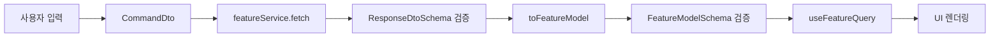

# 데이터 흐름 가이드

> 대상: 신규 기능을 맡은 프론트엔드 개발자. API 응답이 UI에 도달할 때까지 거치는 공통 단계를 설명합니다. 실제 도메인 이름 대신 일반화된 용어를 사용하며, 구현 시 도메인에 맞게 치환하면 됩니다.

## 1. 한눈에 보는 흐름

1. **사용자 입력** → `CommandDto` 구성 (`src/types/<feature>.ts`)
2. **API 호출** → `featureService.fetch`에서 응답 정규화 & Zod 검증
3. **DTO → Model 변환** → `toFeatureModel` 계열 함수로 UI 친화 구조화
4. **Model 검증** → `FeatureModelSchema`로 최종 타입 체크
5. **TanStack Query 캐시** → `useFeatureQuery`에서 Query Key 기반 캐싱
6. **UI 렌더링** → 컴포넌트에서 검증된 모델 사용

## 2. 단계별 설명

### Step A. 요청 만들기 — `CommandDto`

- 위치: `src/types/<feature>.ts`, `src/entities/<feature>/dto.ts`
- 역할: 화면 입력을 `CommandDto` 구조로 묶어 서버와의 계약을 명확히 합니다.
- Zod 활용: `CommandDtoSchema`로 검증해 빈 문자열, 허용되지 않은 enum 값, 음수 페이지 등 잘못된 데이터가 서버로 전달되지 않도록 합니다.  
  → “서버 호출 전 계약서 확인” 단계라고 생각하면 이해가 쉽습니다.

### Step B. API 호출 & 1차 정규화 — `featureService.fetch`

- 위치: `src/services/<feature>.service.ts`
- 역할: 공통 `api` 클라이언트를 통해 데이터를 가져오고, 응답 구조가 `list` 혹은 `data`처럼 섞여 있어도 하나의 형태로 통일합니다.
- Zod 활용: `ResponseDtoSchema`와 `validateResponse` 같은 헬퍼로 응답을 검증합니다. 예상치 못한 필드를 제거하거나 문자열 숫자를 number로 변환하는 등 기본 정리가 여기서 완료됩니다.
- 실패 시 이점: Zod가 상세 이슈를 제공하므로 어떤 필드에서 계약이 어긋났는지 빠르게 파악할 수 있습니다.

### Step C. DTO → Model 변환 — `toFeatureModel`

- 위치: `src/entities/<feature>/mapper.ts`
- 역할: API 구조를 UI에서 바로 사용할 수 있도록 변환합니다. 누락된 값은 폴백을 채우고, 화면에서 쓰이는 이름으로 재정의합니다.
- Zod와의 관계: Mapper는 변환 로직만 담당합니다. 결과는 다음 단계에서 Model 스키마 검증을 거칩니다.

### Step D. Model 검증 — `FeatureModelSchema`

- 위치: `src/entities/<feature>/model.ts`
- 역할: 변환된 데이터를 `FeatureModelSchema.parse`로 검증합니다. 통과한 데이터만 UI에 전달되므로 “UI 렌더 직전 마지막 방어선” 역할을 합니다.
- 이점: 변환 로직에서 실수로 필드를 빠뜨리거나 타입을 잘못 지정하더라도 즉시 오류를 발견할 수 있습니다.

### Step E. TanStack Query 캐시 — `useFeatureQuery`

- 위치: `src/hooks/queries/use<Feature>Query.ts`, `src/constants/query-keys.ts`
- 역할: `useSuspenseQuery`(또는 `useQuery`)로 Step B~D를 묶어 호출하고, `featureQueryKeys.list(command)`처럼 DTO와 동일 입력을 사용해 Query Key를 구성합니다.
- 이점: 동일 파라미터로 다시 요청했을 때 캐시가 정확히 재사용되고, 로딩/에러 상태 관리가 자동화됩니다.

### Step F. UI 컴포넌트

- 위치: `app/<feature>/page.tsx`, `src/components/<feature>/...`
- 역할: `const { data } = useFeatureQuery(command)`로 검증된 모델을 받아 렌더링합니다. 이 시점의 데이터는 이미 Zod 검증을 두 번 거쳤으므로 UI에서 타입 걱정 없이 사용할 수 있습니다.

## 3. 왜 이렇게 나누나요?

- **DTO는 백엔드 계약서**
  - API 파라미터와 응답 구조를 있는 그대로 표현합니다. 계약이 바뀌면 Zod가 즉시 문제를 알려줍니다.
- **Model은 화면 진열용 데이터**
  - UI에서 필요한 필드 구조와 이름만 남기므로, 컴포넌트가 DTO 세부사항을 몰라도 됩니다.
- **Zod를 두 번 쓰는 이유**
  - Step B: “서버가 약속한 형식대로 보냈는지” 확인
  - Step D: “우리가 의도한 변환이 제대로 되었는지” 확인
  - 두 방어선을 통과하면 런타임 타입 오류 가능성이 크게 줄어듭니다.
- **TanStack Query를 사용하는 이유**
  - 서버 상태를 캐시·재검증해 UX를 높이고, 로딩/에러 상태 관리 코드를 최소화합니다.

## 4. 함께 보면 좋은 문서

- DTO ↔ Model 원칙: [`docs/guides/entity-dto-model-guide.md`](./entity-dto-model-guide.md)
- 상태 관리 선택 기준: [`docs/guides/state-management-strategy.md`](./state-management-strategy.md)
- 전체 아키텍처 요약: [`docs/guides/frontend-architecture-overview.md`](./frontend-architecture-overview.md)

## 5. 코드 위치 요약

- `src/types/<feature>.ts` — DTO/Model 타입 선언
- `src/entities/<feature>/dto.ts` — Zod DTO 스키마 및 검증 함수
- `src/entities/<feature>/mapper.ts` — DTO → Model 변환 로직
- `src/entities/<feature>/model.ts` — Zod Model 스키마
- `src/services/<feature>.service.ts` — API 호출, 응답 정규화, 변환 호출
- `src/hooks/queries/use<Feature>Query.ts` — TanStack Query 훅
- `src/constants/query-keys.ts` — 기능별 Query Key 팩토리

## 6. 체크리스트

- [ ] 새로운 파라미터를 추가할 때 `CommandDto` 타입과 스키마를 함께 수정했는가?
- [ ] 응답 구조가 변경되면 DTO 스키마와 Mapper 로직을 동시에 업데이트했는가?
- [ ] Model 스키마를 바꿨다면 UI 컴포넌트 타입도 점검했는가?
- [ ] Query Key에 신규 필드를 반영해 캐시 일관성을 유지했는가?

---

### 핵심 요약

- 데이터는 **API → DTO(Zod) → Model(Zod) → Query → UI** 순서로 흐릅니다.
- DTO는 서버와의 계약, Model은 UI 전용 데이터이며 Mapper가 둘 사이를 연결합니다.
- Zod 검증을 두 번 활용해 변환 오류를 조기에 발견하고, TanStack Query는 검증된 모델만 캐싱합니다.

---

### 예시 명칭 치환 가이드

| 실제 예시                               | 본 가이드에서 사용하는 명칭 |
| --------------------------------------- | --------------------------- |
| `SearchCommandDto`                      | `CommandDto`                |
| `searchService.search`                  | `featureService.fetch`      |
| `toSearchResult` / `toSearchResultItem` | `toFeatureModel` 계열 함수  |
| `SearchResultModelSchema`               | `FeatureModelSchema`        |
| `useSearchQuery`                        | `useFeatureQuery`           |
